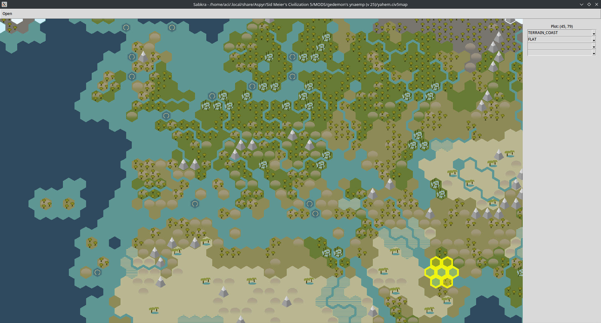

# sabkra

A .civ5map previewer that doesn't require you to load the whole game!

<div align="center">

</div>

## Requirements

* Python >=3.11

* pdm (you can install it with `pip install pdm`).

## Installation and usage

```bash
git clone https://github.com/AcipenserSturio/sabkra
cd sabkra
pdm install
pdm run start
```

# License

sabkra is licensed under the GNU General Public License Version 3.

## Credits

* [CivFanatics civ5map forum thread](https://forums.civfanatics.com/threads/civ5map-file-format.418566/) for initial work documenting the civ5map format.

* [samuelyuan/Civ5MapImage](https://github.com/samuelyuan/Civ5MapImage) for documenting the scenario part of the format.
